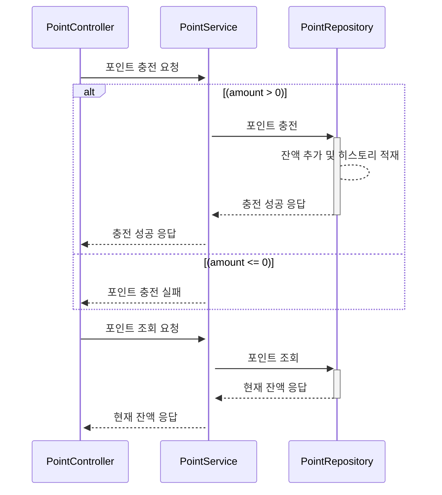
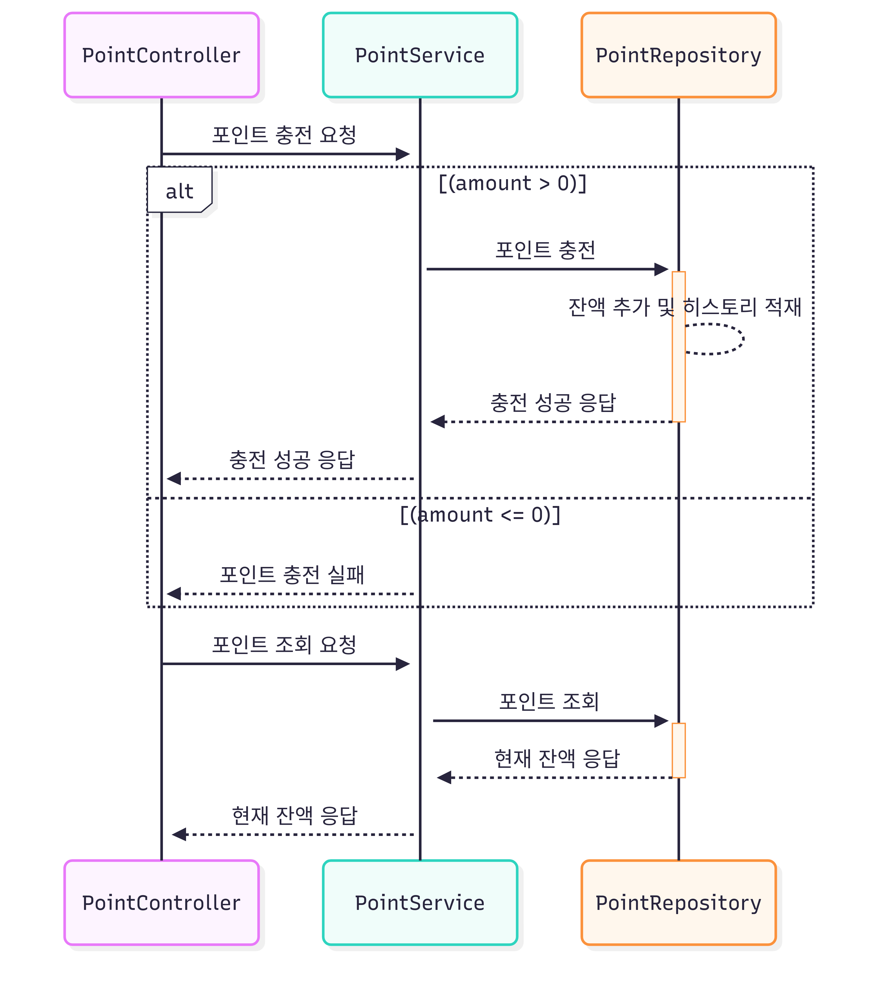
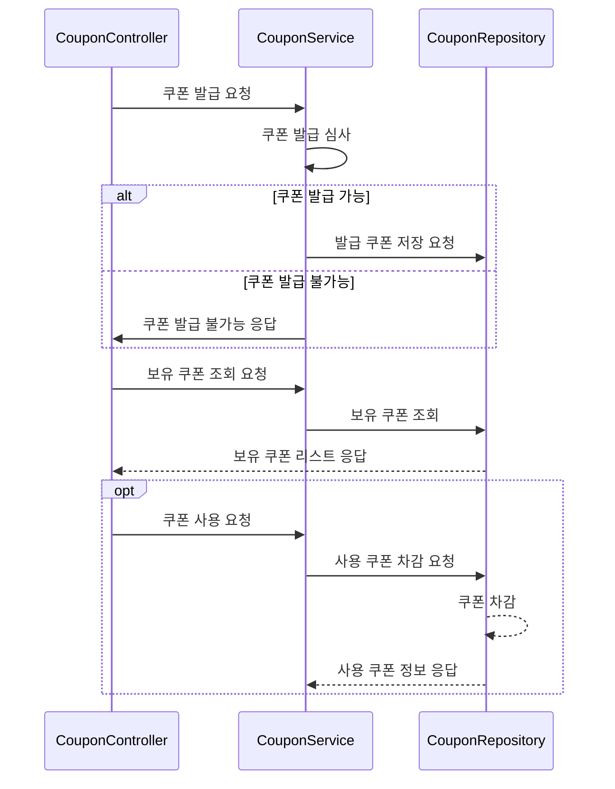
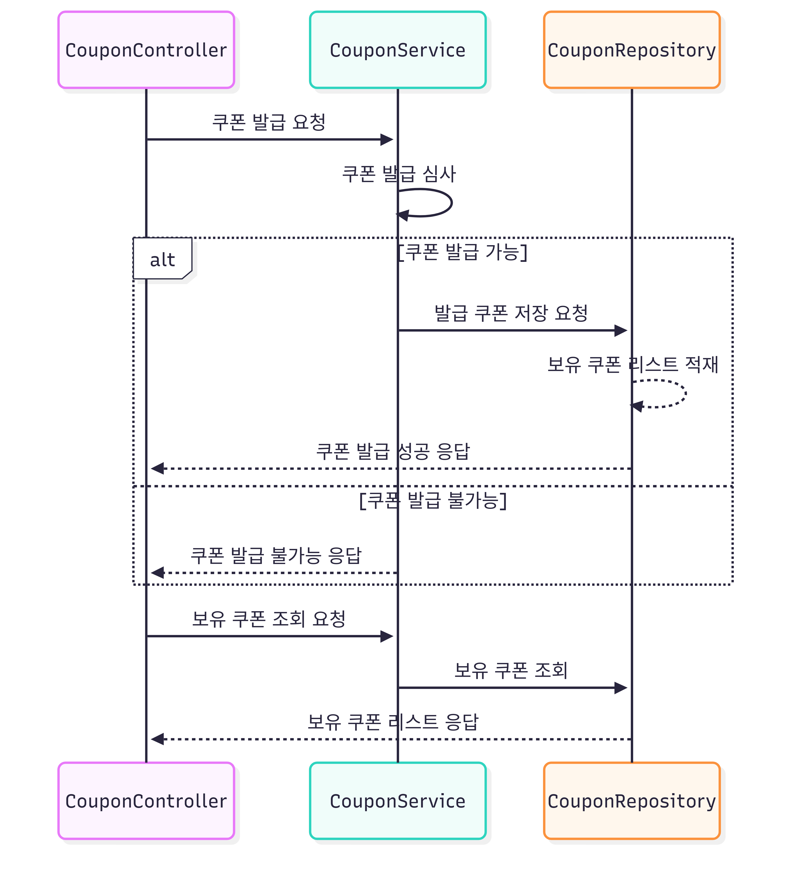
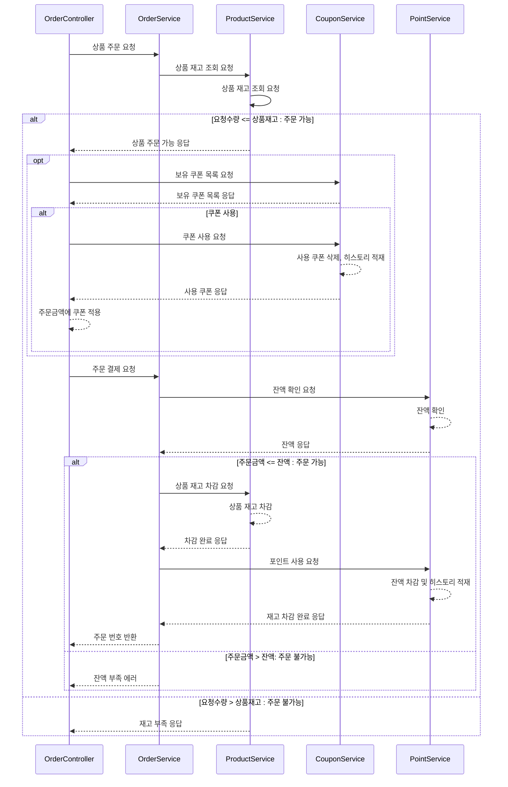
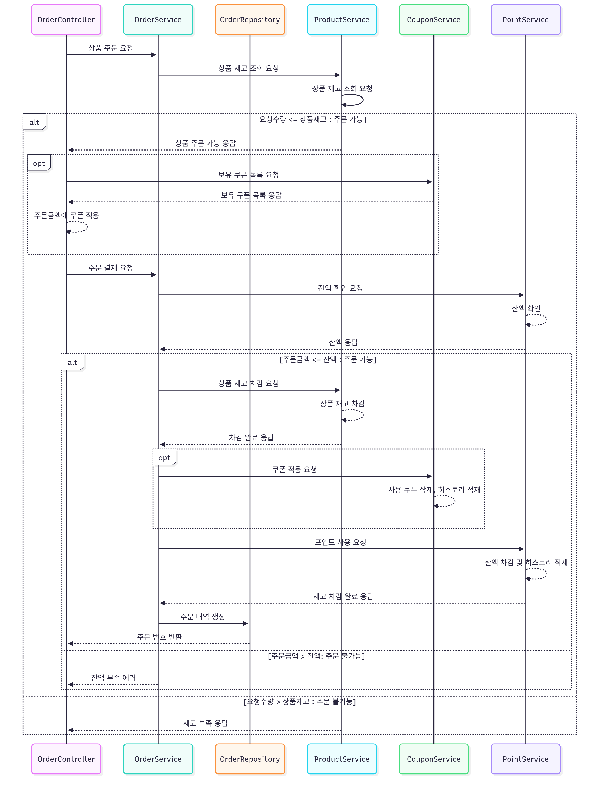

## 프로젝트

### 요구사항 분석
- **기능적** 요구사항
    - 잔액을 충전한다.
        - 잔액 충전은 1,000원 단위로만 가능하다.
        - 0원 또는 음수 금액을 충전할 수 없다.
        - 100,000원 까지만 충전이 가능하다.
    - 잔액을 조회한다.
        - id로 잔액을 조회 시 현재 남은 잔액을 보여준다.
        - id로 히스토리 조회 시 현재까지 사용한 기록을 보여준다.
    - 상품을 조회한다.
        - 상품 목록은 1페이지 당 10개씩 제공한다.
        - 상품 목록에서 상품이름/상품이미지를 제공한다.
        - 상품 클릭 시 상세페이지로 이동한다.
        - 상품 상세페이지에서 상품이름/상품이미지/상품설명/상품 주문 가능 수량을 제공한다.
    - 상품을 주문한다.
        - 상세페이지에서 수량을 정하고 주문 버튼을 누르면, 주문페이지로 이동한다.
        - 주문페이지에서는 선택한 상품이름/상품수량 정보를 제공한다.
    - 상품을 결제한다.
        - 사용자 id와 배송받는사람/배송주소 및 선택한 상품id/상품수량 정보를 받으면 주문가격을 계산하고 쿠폰 사용 여부를 확인한다.
            - id가 소지한 쿠폰 목록을 확인한다.
            - 쿠폰을 선택하여 주문 가격에 적용한다.
        - 최종 주문가격이 나오면 잔액을 비교하여 주문 가능한지 여부를 확인한다.
            - 주문이 가능할 경우 id의 주문내역에 추가되고, 해당 상품 수량이 감소하며, 잔액이 차감되고, 주문 정보를 외부 데이터 플랫폼에 전송한다.
            - 주문이 불가능할 경우 주문이 실패하며, “잔액이 부족합니다” 안내가 뜬다.
    - 선착순 쿠폰을 발급한다.
        - 1등은 30%/ 2등은 20%/ 3등은 10% 할인 쿠폰을 제공한다.
        - 언제 제공?
    - 인기 판매 상품을 조회한다.
        - 최근 3일간 가장 많이 팔린 상위 5개 상품 목록을 제공한다.
- **비기능적** 요구사항

### 시퀀스 다이어그램
- 포인트 충전 및 조회




- 쿠폰 발급 및 조회, 사용




- 상품 주문 및 결제




```sql

```

## Getting Started

### Prerequisites

#### Running Docker Containers

`local` profile 로 실행하기 위하여 인프라가 설정되어 있는 Docker 컨테이너를 실행해주셔야 합니다.

```bash
docker-compose up -d
```